# 
 Hello! This is Rubi Preethi... We all at sometime experienced the situation when we really wanted to watch something productive on Youtube but ended up scrolling mindlessly or watching other videos of no relevance.... That's why I thought of building this chrome extension... This will be much useful for those who wish to spend their time productively! Start using your time productively with this extension!! Hope it will be helpful:) 


# 📊 Mission Focus - YouTube Productivity Tracker

A browser extension that intelligently tracks your YouTube viewing time and categorizes videos as productive or unproductive using AI.

# 🎯 Mission Focus

> **Break free from mindless scrolling. Reclaim your time. Achieve your goals.**


---

## 🧠 The Problem: You're Not Alone

### The Brainrot Epidemic

We've all been there. You open YouTube to watch a quick tutorial on React hooks... and somehow, 3 hours later, you're watching a video about the world's largest rubber duck collection. 

**Sound familiar?**


### The Statistics Are Alarming

- 📊 **70%** of people report feeling guilty about their YouTube usage
- ⏰ Average person spends **2.5 hours daily** on unintentional content
- 🎯 Only **23%** actually watch what they intended to watch
- 😔 **89%** feel less productive due to algorithmic rabbit holes

### The Real Cost

```
Time wasted per day: 2.5 hours
Time wasted per week: 17.5 hours
Time wasted per year: 913 hours (38 DAYS! 😱)

That's enough time to:
✅ Learn 3 new programming languages
✅ Get fit and run a marathon
✅ Build 10 full-stack projects
✅ Read 50+ books
```

---

## 💡 The Solution: Mission Focus

**Mission Focus** is not just another productivity extension. It's your personal accountability partner that understands **context** and **intent**.

### 🚀 How It Works

```mermaid
graph LR
    A[Open YouTube] --> B{Video Starts}
    B --> C[AI Analyzes Content]
    C --> D{Matches Your Goals?}
    D -->|Yes ✅| E[Productive Timer ⏱️]
    D -->|No ❌| F[Unproductive Timer ⏰]
    E --> G{Video Paused?}
    G -->|Yes| H[⏸️ Check if Still Thinking]
    H --> I{User Responding?}
    I -->|No Response| J[Pause Timer]
    I -->|Still Thinking| E
    F --> K{Limit Exceeded?}
    K -->|Yes| L[🔔 Friendly Reminder]
    E --> M[💪 Motivational Boost]
```



---

## ✨ Features That Actually Work

### 🎯 Smart Content Recognition

Our **dual-layer AI system** ensures accuracy:

1. **Keyword Matching**: Instantly matches video titles, descriptions, and tags with your productivity areas
2. **Gemini AI Analysis**: Deep content understanding to catch edge cases


### ⏸️ Intelligent Pause Detection

**NEW!** Mission Focus understands that learning requires reflection time.

When you pause a video, we know you might be:
- 🤔 Processing complex information
- 💭 Taking notes
- 🧪 Testing code from the tutorial
- 📝 Practicing what you learned

**How it works:**

```
Video Paused for 2+ minutes
        ↓
🔔 Notification: "Are you still thinking about this?"
        ↓
┌─────────────────┬──────────────────┐
│ "Yes, thinking" │ "No, just paused"│
└─────────────────┴──────────────────┘
        ↓                    ↓
Timer continues      Timer pauses
```

**Why this matters:**
- ✅ Accurate time tracking (no inflated numbers)
- ✅ Respects your learning process
- ✅ Distinguishes active learning from abandonment
- ✅ Prevents false positives for productive time

### 📊 Personalized Productivity Tracking

Set your goals, track your progress:

- ⏱️ **Productive Time Goal**: "I want to spend 3 hours learning web development today"
- 🚫 **Unproductive Time Limit**: "Max 30 minutes of entertainment"
- 📈 **Real-time Dashboard**: See your progress at a glance
- ⏸️ **Pause Time Tracking**: Separate active learning from inactive time

### 🔔 Intelligent Notifications

We don't nag. We **motivate**:

#### When You're Productive 💪
- "🔥 Halfway there! You've watched 1.5 hours of productive content!"
- "🎉 GOAL ACHIEVED! You crushed your 3-hour target!"
- "🏆 You're in the top 10 most productive users this week!"

#### When Video is Paused ⏸️
- "🤔 Are you still thinking about this? Let me know!"
- "📝 Taking notes? Great! Click 'Still Thinking' to continue tracking"
- "⏰ Video paused for 5 minutes. Timer paused automatically"

#### When You're Off-Track 🎯
- "⏰ Gentle reminder: You've used your 30-min entertainment budget"
- "🎯 Time to get back on track! Your programming goal awaits"
- "💡 Quick break's over! Let's refocus on your fitness journey"

### 🏆 Global Leaderboard

Compete with yourself and others:

```
🥇 Top 1: Sarah M. - 47.5 productive hours this week
🥈 Top 2: Alex K. - 45.2 productive hours this week  
🥉 Top 3: YOU! - 42.8 productive hours this week 🎉
```

---

## 🛠️ Tech Stack

Built with modern, robust technologies:

### Frontend
- **HTML5** - Semantic structure
- **CSS3** - Beautiful, responsive design
- **Vanilla JavaScript** - Fast and efficient

### Backend
- **Node.js** - Scalable server environment
- **Express.js** - RESTful API framework
- **MongoDB** - Flexible data storage

### AI & APIs
- **Google Gemini API** - Advanced content analysis
- **YouTube Data API v3** - Video metadata retrieval

### Chrome Extension APIs
- **chrome.tabs** - Tab monitoring
- **chrome.notifications** - Smart notifications
- **chrome.storage** - User preferences
- **chrome.idle** - Pause detection

---


# Load the extension in Chrome
# 1. Open chrome://extensions/
# 2. Enable "Developer mode" (toggle in top right)
# 3. Click "Load unpacked"
# 4. Select the 'extension' folder from this project
```


## 🎮 Quick Start Guide

### Step 1: Initial Setup


1. Click the Mission Focus icon in your toolbar
2. Go to **Settings** ⚙️
3. Enter your email address
4. Define your productivity area(s):
   - Programming
   - Fitness & Health
   - Web Development
   - News & Current Affairs
   - Competitive Exam Prep
   - Or custom: "Machine Learning", "Digital Marketing", etc.

### Step 2: Set Your Goals


```
Productive Time Goal: 3 hours/day
Unproductive Time Limit: 30 minutes/day
Pause Detection: Enabled ✅
Pause Timeout: 2 minutes
```

### Step 3: Start Tracking


Click **"Start Tracking"** and browse YouTube normally. Mission Focus works silently in the background!

### Step 4: Respond to Pause Prompts

When you pause a video to think:
- Click **"Yes, thinking"** if you're actively processing the information
- Click **"No, just paused"** or ignore if you've moved away
- Timer automatically pauses after no response for your set timeout

---


## 🎯 Example  Use Cases

### 👨‍💻 For Developers
```
Area: "Web Development, React, JavaScript"
Goal: 4 hours of coding tutorials daily
Pause Detection: Perfect for testing code snippets
Result: Build projects faster, stay updated with latest tech
```

### 🏋️ For Fitness Enthusiasts  
```
Area: "Fitness, Workout Routines, Nutrition"
Goal: 1 hour of fitness content daily
Pause Detection: Take breaks between exercise demonstrations
Result: Stay motivated, learn proper form, achieve fitness goals
```

### 📚 For Students
```
Area: "JEE Preparation, Physics, Mathematics"
Goal: 6 hours of study content daily
Pause Detection: Solve problems while video is paused
Result: Stay focused during exam prep, avoid distractions
```

### 📰 For Professionals
```
Area: "Business News, Industry Trends, Leadership"
Goal: 1 hour of professional development daily
Pause Detection: Reflect on key insights
Result: Stay informed, make better decisions, grow career
```

---


HAPPY LIFE! PRODUCTIVE LIFE:)
                - Rubi Preethi
